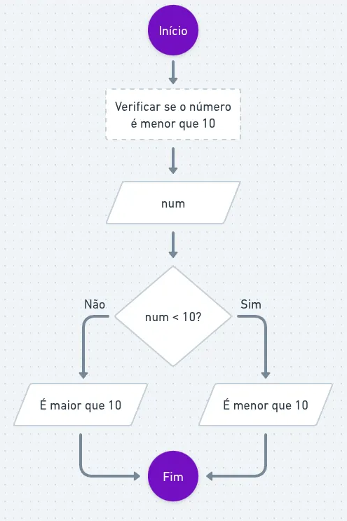
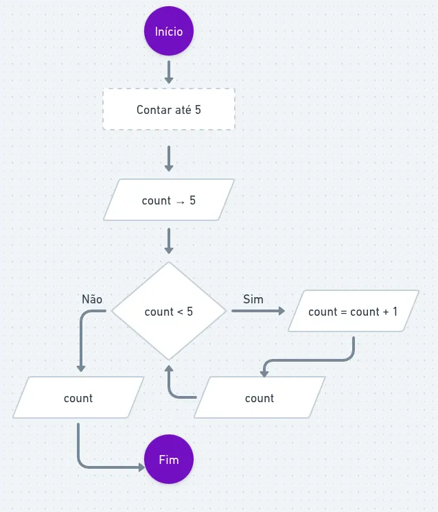

### Descrição Narrativa

#   Fazer um café coado
    1. Pegue uma chaleira e encha com 500ml de água;
    2. Coloque a chaleira no fogão e ligue o fogo;
    3. Enquanto a água aquece, pegue o suporte para filtro de papel;
    4. Coloque um filtro de papel limpo no suporte;
    5. Adicione 3 colheres de sopa de pó de café dentro do filtro;
    6. Pegue uma garrafa térmica ou caneca grande e posicione o suporte de filtro sobre ela;
    7. Quando a água começar a ferver, desligue o fogo com cuidado;
    8. Despeje um pouco da água quente sobre o pó para umedecer;
    9. Continue despejando lentamente o resto da água sobre o café;
    10. Aguarde toda a água passar pelo pó e terminar de coar;
    11. Retire o suporte com o filtro e descarte o pó;
    12. Tampe a garrafa ou sirva na caneca;
    13. Adicione açúcar ou adoçante, se desejar;
    14. Aproveite seu café! ☕

#   Configurar o despertador no celular
    1. Pegue o celular e desbloqueie a tela;
    2. Localize e abra o aplicativo de relógio ou despertador;
    3. Toque na opção para adicionar um novo alarme;
    4. Ajuste a hora e os minutos que deseja para o alarme;
    5. Se necessário, selecione os dias da semana em que o alarme deve repetir;
    6. Escolha o toque do alarme;
    7. Dê um nome ao alarme (ex: “Academia”);
    8. Toque em “Salvar” ou “Concluir”.

#   Ligar um computador
    1. Verifique se o computador está conectado à tomada ou fonte de energia;
    2. Pressione o botão de ligar;
    3. Aguarde alguns segundos até o sistema carregar;
    4. Quando a tela de login aparecer, digite seu usuário (se tiver);
    5. Digite a senha de acesso, se tiver, e pressione Enter**;**
    6. Aguarde a área de trabalho ou tela inicial carregar completamente;
    7. Confirme se tudo está funcionando corretamente antes de iniciar o uso.

#   Carregar o celular
    1. Pegue o carregador compatível com o modelo do seu celular;
    2. Verifique se o carregador está conectado à tomada;
    3. Insira o cabo na entrada de carregamento do celular;
    4. Confirme se o celular está carregando;
    5. Deixe o celular carregando até atingir a porcentagem desejada ou carga completa;
    6. Quando terminar, retire o cabo com cuidado da entrada do celular;
    7. Desconecte o carregador da tomada, se necessário, e guarde-o.

#   Assistir a um filme em casa
    1. Escolha a plataforma onde deseja assistir (ex: Netflix, Amazon Prime, YouTube);
    2. Ligue a TV, computador, tablet ou celular;
    3. Acesse o aplicativo ou site da plataforma escolhida;
    4. Faça login com seu usuário e senha, se necessário;
    5. Use a barra de busca ou navegue pelas categorias para escolher um filme;
    6. Clique em “Reproduzir” ou “Assistir agora”;
    7. Ajuste o volume e, se desejar, ative as legendas ou mude o idioma;
    8. Sente-se e aproveite o filme;
    9. Ao terminar, feche o aplicativo ou desligue o dispositivo.

#   Regar uma planta
    1. Pegue um regador ou garrafa ou recipiente;
    2. Encha o recipiente com água;
    3. Caminhe até a planta que será regada;
    4. Posicione o regador sobre o vaso, próximo à base da planta;
    5. Derrame a água no solo;
    6. Observe se o solo está úmido, sem encharcar;
    7. Repita o processo com outras plantas, se houver;
    8. Guarde o regador no local apropriado.

#   Fazer uma pipoca
    1. Pegue uma panela com tampa;
    2. Coloque-a sobre a boca do fogão;
    3. Adicione um fio de óleo no fundo da panela;
    4. Acrescente o milho para pipoca;
    5. Adicione sal ou outro tempero;
    6. Tampe a panela;
    7. Ligue o fogo;
    8. Aguarde alguns minutos até ouvir os primeiros estouros;
    9. Tampe a panela;
    10. Quando os estouros ficarem mais frequentes, agite levemente a panela;
    11. Quando os estouros diminuírem significativamente desligue o fogo;
    12. Com cuidado, destampe a panela para evitar vapor quente;
    13. Transfira a pipoca para um recipiente;
    14. Sirva! 🍿

#   Participar de uma reunião online
    1. Verifique o horário da reunião na agenda ou calendário;
    2. Confirme se você recebeu o link de acesso (por e-mail, Slack, WhatsApp, Gmail.);
    3. Pouco antes do horário marcado, encontre um local silencioso e com boa iluminação.
    4. Ligue e conecte seu dispositivo (notebook, celular ou computador) à internet;
    5. Abra o aplicativo ou plataforma que vai usar (como Zoom, Google Meet, Teams, etc.);
    6. Clique no link da reunião;
    7. Ligue a câmera e o microfone conforme necessário;
    8. Entre na reunião;
    9. Durante a reunião, ouça com atenção e participe quando for solicitado;
    10. Anote informações importantes, se necessário;
    11. Ao final, clique em “Encerrar chamada” ou “Sair da reunião”.

#   Criar uma lista com as tarefas da semana
    1. Escolha onde vai criar a lista (papel, planner ou app de notas);
    2. Pense em todos os compromissos e responsabilidades da semana;
    3. Anote todas as tarefas que precisa realizar;
    4. Classifique cada tarefa por categoria, se desejar (ex: trabalho, casa, estudos);
    5. Organize as tarefas por dia da semana, de acordo com prazos e prioridades;
    6. Revise a lista e ajuste conforme necessário;
    7. Adicione lembretes ou horários, se for útil;
    8. Salve ou guarde a lista em um local de fácil acesso;
    9. Consulte a lista diariamente e marque as tarefas concluídas. ✅

#   Assistir a um vídeo do Diego no canal da Rocketseat 💜
    1. Pegue seu celular, tablet ou computador;
    2. Conecte o dispositivo à internet;
    3. Acesse o YouTube pelo aplicativo ou navegador;
    4. Digite "Rocketseat" na barra de busca;
    5. Escolha um vídeo do Diego Fernandes;
    6. Clique para abrir o vídeo;
    7. Ajuste o volume;
    8. Assista o conteúdo;
    9. Ao final, aplique o que aprendeu ou salve o vídeo para rever depois.

###     Fluxograma

#       EXERCICIO 1
        

#       EXERCICIO 2
               

#       EXERCICIO 3
        

###     Pseudocódigo

#   Imprimir um número em tela
Início
  Escreva("Digite um número:")
  Leia num
  Escreva("Você digitou:", num)
Fim 

#   Somar dois números
Início
  Leia num1
  Leia num2
  soma ← num1 + num2
  Escreva("Resultado:", soma)
Fim

#   Contar de 1 até 10 usando loop
Início
  i ← 1
  Enquanto i ≤ 10
    Escreva(i)
    i ← i + 1
Fim

#   Verificar se o número é par ou ímpar
Início
  Leia num
  Se num % 2 = 0 então
    Escreva("Par")
  Senão
    Escreva("Ímpar")
Fim

#   Verificar se número é positivo, negativo ou zero
Início
  Leia num
  Se num > 0 então
    Escreva("Positivo")
  Senão Se num < 0 então
    Escreva("Negativo")
  Senão
    Escreva("Zero")
Fim

#   Calcular média de 3 notas
Início
  Leia n1, n2, n3
  media ← (n1 + n2 + n3) / 3
  Escreva("Média:", media)
Fim

#   Verificar se aluno foi aprovado (com média ≥ 5)
Início
  Leia nota1, nota2
  media ← (nota1 + nota2) / 2
  Se media ≥ 5 então
    Escreva("Aprovado")
  Senão
    Escreva("Reprovado")
Fim

#   Maior entre dois números
Início
  Leia a, b
  Se a > b então
    Escreva("Maior:", a)
  Senão
    Escreva("Maior:", b)
Fim

#   Mostrar os múltiplos de 3 até 30
Início
  i ← 1
  Enquanto i ≤ 30
    Se i % 3 = 0 então
      Escreva(i)
    i ← i + 1
Fim

#   Contagem regressiva de 10 até 1
Início
  i ← 10
  Enquanto i ≥ 1
    Escreva(i)
    i ← i - 1
Fim